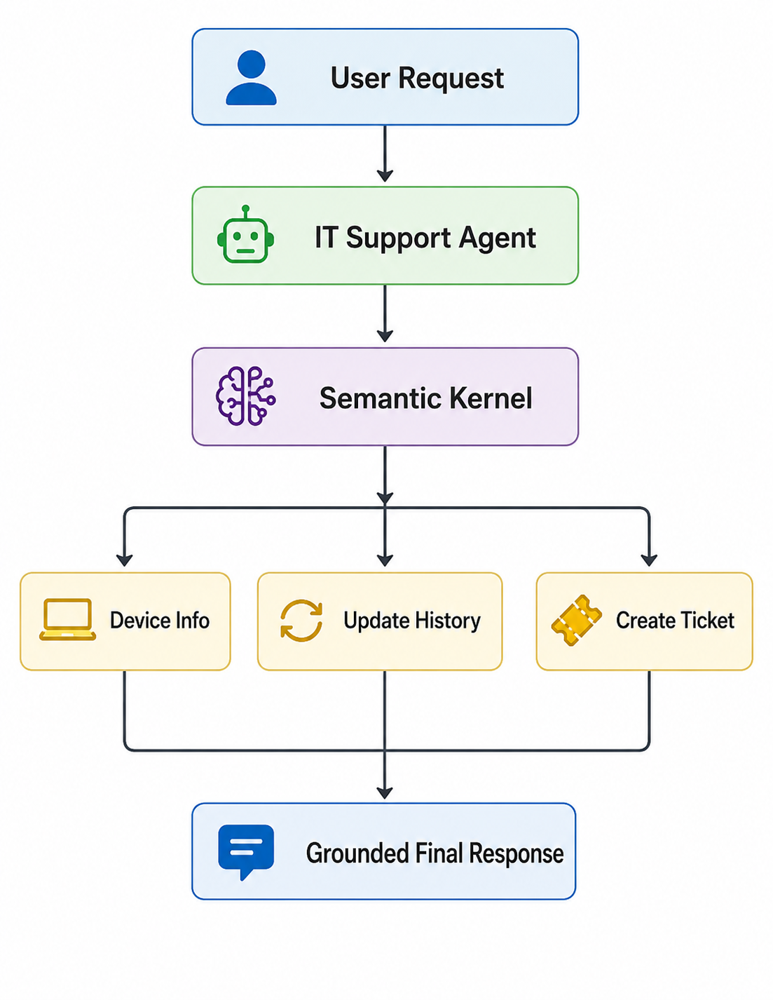
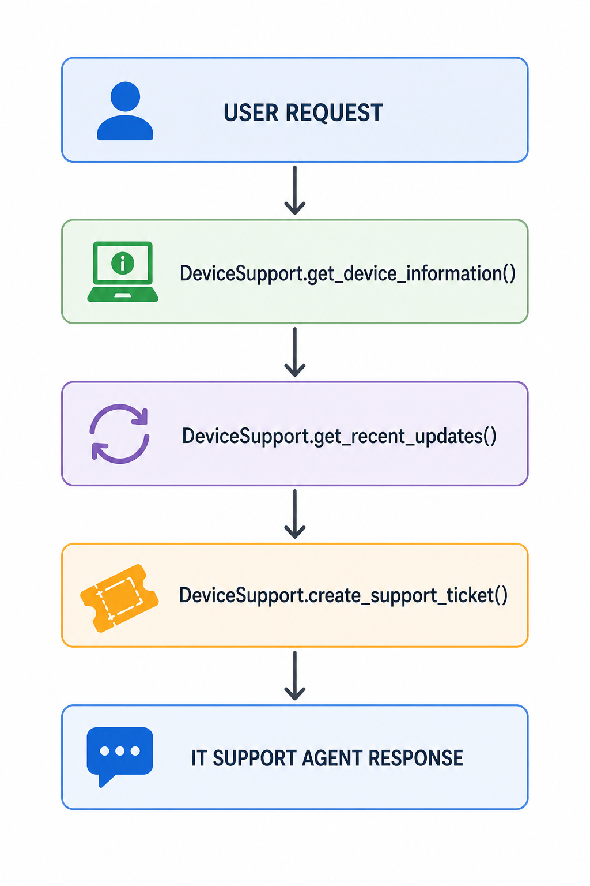

# IT Support Agent with Microsoft Semantic Kernel

A single AI agent built with **Microsoft Semantic Kernel** and **Azure OpenAI** that investigates an employee laptop issue, retrieves device information through plugins, identifies the likely cause, and automatically creates a support ticket when escalation is required.

---

## Features

- 🤖 Single AI Agent built with Microsoft Semantic Kernel
- 🔧 Automatic Function Calling
- 💻 Retrieves employee device information
- 🔄 Reviews recent Windows updates
- 🧠 Diagnoses the reported issue
- 🎫 Creates a support ticket automatically
- ☁️ Uses Azure OpenAI
- 📋 Produces a grounded final response based on tool results

---

## Architecture

<p align="center">
  
</p>

---

## Project Structure

```text
.
├── app.py
├── device_support_plugin.py
├── requirements.txt
├── .env.example
├── .gitignore
└── README.md
```

---

## Prerequisites

- Python 3.11 or later
- Azure OpenAI deployment
- Microsoft Semantic Kernel

---

## Setup

### 1. Clone the repository

```bash
git clone https://github.com/YOUR_USERNAME/semantic-kernel-it-support-agent.git

cd semantic-kernel-it-support-agent
```

### 2. Create a virtual environment

```bash
python -m venv .venv
```

Activate it.

Windows:

```bash
.venv\Scripts\activate
```

macOS / Linux:

```bash
source .venv/bin/activate
```

### 3. Install dependencies

```bash
pip install -r requirements.txt
```

### 4. Configure environment variables

Copy:

```text
.env.example
```

to

```text
.env
```

Then provide your Azure OpenAI credentials.

### 5. Run the application

```bash
python app.py
```

---

## Expected Workflow

The agent performs the following steps automatically:

1. Reads the employee device information.
2. Retrieves the recent Windows update history.
3. Determines the likely cause of the issue.
4. Decides whether IT escalation is required.
5. Creates a support ticket when necessary.
6. Returns a grounded response to the employee.

---

## Sample Output

<p align="center">
  
</p>

---

## Demo Note

This project uses **mocked enterprise data** for demonstration purposes.

The device information, Windows update history, and support ticket creation are simulated to demonstrate how a Semantic Kernel agent can use plugins through automatic function calling.

In a production environment, these functions could integrate with enterprise services such as:

- Microsoft Intune
- Microsoft Graph
- ServiceNow
- Jira Service Management
- Azure DevOps
- Internal enterprise APIs

---

## Technologies

- Python
- Microsoft Semantic Kernel
- Azure OpenAI
- Function Calling
- AI Plugins
- AsyncIO

---

## License

This project is intended for educational and demonstration purposes.
